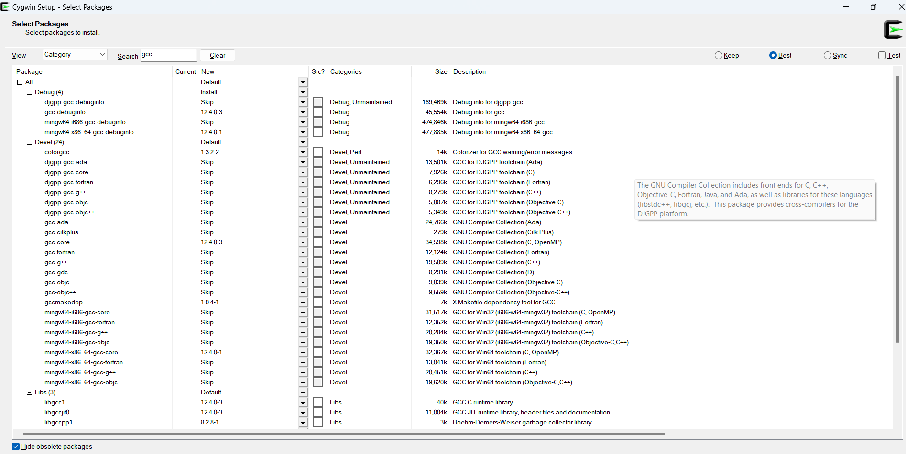
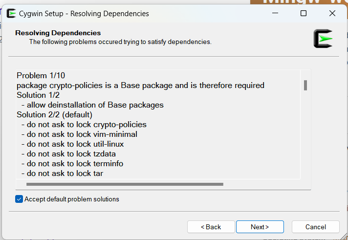

## Description

This example runs Python packages that uses native extension, this showcase how we can use OPENAI pythong package, you can see a guide [here](https://github.com/graalvm/graal-languages-demos/blob/main/graalpy/graalpy-native-extensions-guide/README.md), 
this application takes a text entry passed to the Java main method as an argument and then pass it the OPENAI API using GraalPy,
the code in this example is pretty much the code in the [official OPENAI API documentation](https://platform.openai.com/docs/quickstart/create-and-export-an-api-key).

Check the [GraalPy implementation details](https://platform.openai.com/docs/quickstart/create-and-export-an-api-key). The
implementations details in short are the following, the Python code that is embedded in Java has to return a function
which is mapped using a Java interface, in this case is the functional interface which method takes a string and
returns another interface tha is also mapped, this interface has a method that returns a list of objects of another interface, the list in 
python is a property and not a function as opposed to our code, this is because it has to be mapped, the objects in the list are also mapped
to an interface that has method called `message` that in python is actually a property of type string
and finally this message method return another object that is mapped using an interface that is basically wrapping a string, 
this is expressed in the form of a method inside the last interface that returns a string, all this might sound confusing, check the code.

## Development Environment Requirements

As you can see the guide indicate the requirements are:

* An IDE or text editor, I used IntelliJ IDEA 2024.3 ultimate edition here you can leverage [language injections](https://www.jetbrains.com/help/idea/using-language-injections.html#use-language-injection-comments)
* A supported JDK, preferably the latest GraalVM JDK, I used Oracle GraalVM Java-21
* a C compiler toolchain (e.g., GCC, Cargo)

## Development Environment Setup

### Using Python Packages That Use Native Extensions
It was indicated in the requirements that a C compiler is needed, for example GCC, Cargo, etc, in my case I used 
Ubuntu through WSL which comes with the GCC installed by default but I will show how to install GCC compiler directly
on Windows if you don't want to use WSL.

#### Using WSL(Windows Subsystem for Linux)
1. Install WSL, I did it on Windows 11 build 22631.4460. The default distro is Ubuntu. Checkout the [installation guide](https://learn.microsoft.com/en-us/windows/wsl/install). However, all the commands you may need
are the bellow, alternatively you can download "Ubuntu" app from "Microsoft Store" and just run so Ubuntu WSL is installed on
your computer, at installation you will be able to set up your user name and password, this is important. Uninstalling and 
reinstalling or installing is very straight forward and easy.

```bash
  wsl install # enables/set up all features necessary to run WSL
  wsl install -d <distro_name>  # installs the indicated distro
  wsl --list --online # returns a list of valid distributions that can be installed
  wsl -l -v # shows a list of installed distributions with its version
  wsl -d <distro_name> # run the indicated distribution
  wsl --terminate <distro_name> # terminates indicated distro
  wsl --shutdown  # terminates all running distributions and the WSL2 lightweight utility virtual machine
  wsl --unregister  <distro_name># uninstalls the indicated distro 
```

2. You can share Windows environment variables using [WSLENV](https://learn.microsoft.com/en-us/windows/wsl/filesystems#share-environment-variables-between-windows-and-wsl-with-wslenv) 
this will enable you to call the variable from both operating systems, if it points to an executable you could run commands using that executable, but 
the limitation in our case is that when running our code from IntelliJ using the "remote development"/"connect to WSL" option
the JDK won't be recognized by the IDE, and as stated in [IntelliJ´s instructions](https://www.jetbrains.com/help/idea/how-to-use-wsl-development-environment-in-product.html#create_project_for_wsl)
we need to install the JDK in our linux distro. meaning in this case sharing a variable won't be good enough. So [Install GraalVm](https://www.graalvm.org/latest/getting-started/linux/), the easiest way to 
do this is using SDKMAN, just make sure to install all other utilities SDKMAN needs to run. If you choose to do it manually after you
unzip the file make sure you set up the `JAVA_HOME` environment variable correctly, this can be done either in `etc/environmet` file which
sets the variable across all users, or either in `.profile` or `.bashrc` files, it seems to be more common to define it in `.bashrc`, both 
located inside `/home/<user>` directory. Is usefull to know you can access windows files from the distro, just head `mnt` directory 
and there you can choose the hard disk you need, in windows is the `C` drive, you can also mount external storage disks.
I used SDKMAN to install Oracle's `java 21.0.5-graal`. Ubuntu package manager is called APT(Advanced Package Tool) which interacts
with "dpkg packaging system"

    * In fact the first thing you should do in a distro is update and upgrade its package manager, in our case is APT`
    ```bash
    # updates all packages metadata to know what versions can be installed or upgraded
    sudo apt update or sudo apt-get update
    sudo apt upgrade # upgrade all packages to their latests versions based on the cache/metadata from the package tool database
    sudo apt-get upgrade <package_name> # upgrade single package
    ```
    
    * Make sure curl, zip, unzip utilities/packages/dependencies are installed in your distro
   ```bash
   sudo apt list --installed # full list of pakcages
   sudo apt list --installed | grep <pakcage_name> # returns packages that matches the name
   apt-cache search <search term> # finds packages that contains the search term
   apt-cache pkgnames <search_term> # finds packages that starts with the searc term
   apt-cache showpkg <package_name>  # shows the package info
   sudo apt-get install <package_name> # install package latest version automatically
   sudo apt-get install <package_name> --no-upgrade # if already installed it wont be upgraded to latest version(according to apt database)
   sudo apt-get install <package_name> --only-upgrade # doesn't install package if it doesn't exist, it will only upgrade it if already installed
   sudo apt-get install <package_name>=<version_number> # install specific version
   sudo apt-get remove <package_name> # deletes package but not config files
   sudo apt-get purge <package_name> # deletes package and its config files
   sudo apt-get clean # clears apt cache
   sudo apt-get autoclean # clears packages files with newer versions, meaning they won't be used anymore
   sudo apt-get autoremove # removes dependencies of packages that were unistalled
    ```
   
    * install SDKMAN
   ```bash
   curl -s "https://get.sdkman.io" | bash
    ```
   
   * After installing SDKMAN, you might need to run `source .bashrc` to refresh the shell and be
   able to install Oracle's Java 21 GraalVm JDK using SDKMAN, `JAVA_HOME` is set automatically
   ```bash
   sdk install java 21.0.5-graal
   ```
3. Install GCC `sudo apt-get install`

#### Using GCC and Cargo In Windows(Rust compiler) 
1. As indicated in the [GCC documentation](https://gcc.gnu.org/install/specific.html#windows), since Windows 11 supports x86_64(x64 for short)
architecture only we know we have to go with the option in that section which is
installing [mingw](https://www.mingw-w64.org/downloads/) here you have different options you can either use Cygwin,
LLVM-MinGW, MinGW-W64-builds, w64devkit, WinLibs.com, I choose [Cygwin](https://cygwin.com/install.html), just download
"setup-x86_64.exe" and run it. Choose the following packages

   * 

   Then let it resolve some dependencies

   * 

   Then confirm any dialog and let it download the binaries.


2. Cargo, the Rust compiler, is needed according to a message I get when compiling the app. I selected [x86_64-pc-windows-msvc](https://forge.rust-lang.org/infra/other-installation-methods.html) in the 
official documentation but when you you try to install it you're informed that some you need Windows APIS from Rust visual C++ dependencies, 
basically you have to install visual studio, I used community edition, in the installation flow make sure you install
"Desktop development with C++". Check this [guide](https://learn.microsoft.com/en-us/windows/dev-environment/rust/setup) if you need to install these dependencies.


IMPORTANT: I opened an issues because, at least in windows, some linker fails to link
the compiled Python native extension. Check the issue [here](https://github.com/oracle/graalpython/issues/456). So
for now we should continue using a Linux set up